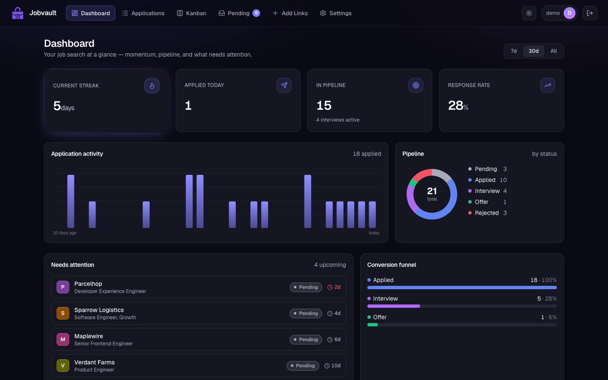
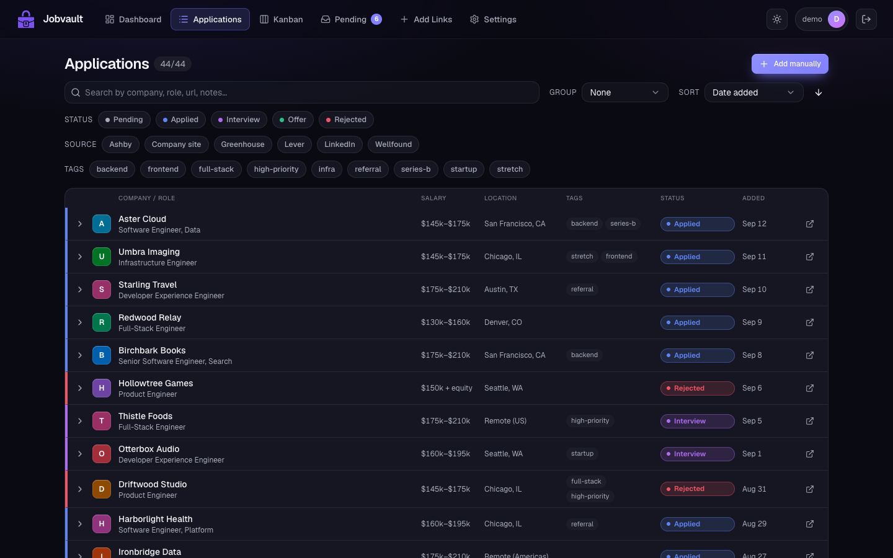
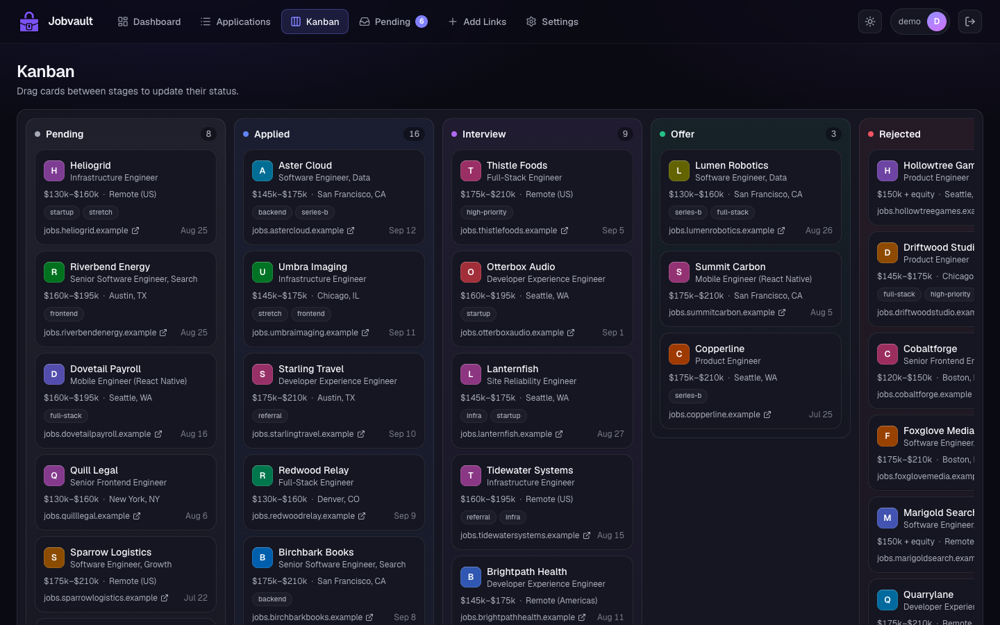
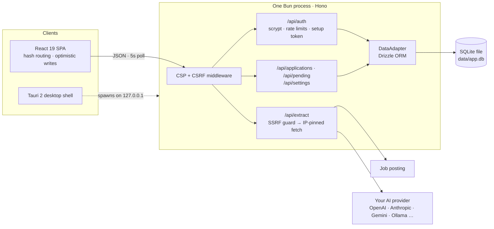

# Jobvault

[](https://github.com/julianavellaneda/jobvault/actions/workflows/ci.yml)
[](https://github.com/julianavellaneda/jobvault/actions/workflows/docker-publish.yml)
[](LICENSE)
[](https://github.com/julianavellaneda/jobvault/pkgs/container/jobvault)

A polished, **self-hostable**, human-in-the-loop job-application tracker. Paste links, work through them, track momentum. **Explicitly not** auto-apply, scraping, or mass-submission — those are non-goals.

**Stack:** Vite + React 19 + React Compiler + TypeScript · Tailwind v4 · shadcn-style UI · Hono on Bun · Drizzle ORM · `bun:sqlite` · AGPL-3.0. Single process, one SQLite file, no external services required. Typically <50 MB RAM.

## Screenshots

| Dashboard | Applications | Kanban |
|---|---|---|
|  |  |  |

## Quickstart — Docker (recommended)

```yaml
# docker-compose.yml
services:
  app:
    image: ghcr.io/julianavellaneda/jobvault:latest
    ports:
      - "3000:3000"
    volumes:
      - ./data:/app/data        # SQLite lives here — back this up
    environment:
      SESSION_SECRET: ${SESSION_SECRET}   # required; openssl rand -base64 48
    restart: unless-stopped
```

```
docker compose up -d
```

Open <http://localhost:3000>. The DB is created and migrated on first boot.

## Quickstart — desktop app

Prefer a double-clickable app over running a server? Grab the latest build for
your platform from the [Releases page](https://github.com/julianavellaneda/jobvault/releases/latest):

- **macOS** — `Jobvault_<version>_aarch64.dmg` (Apple Silicon) or `_x64.dmg` (Intel)
- **Linux** — `jobvault_<version>_amd64.AppImage` or `.deb`

The desktop app is a thin Tauri 2 shell around the same Hono server; data lives
in your OS app-data dir (`~/Library/Application Support/com.jobvault.desktop/`
on macOS, `~/.local/share/com.jobvault.desktop/` on Linux) and the session key
is generated locally on first launch. No external services, no cloud sync.

> macOS bundles (v0.4.3+) are signed with a Developer ID Application
> certificate and notarized by Apple, so the `.dmg` opens without
> Gatekeeper warnings. Linux `.AppImage` / `.deb` artifacts are unsigned.

## First run

1. Start the app (Docker above, or `bun install && SESSION_SECRET=$(openssl rand -base64 48) bun run start`).
2. Open <http://localhost:3000>. You'll see a one-time setup form — pick a username (3-32 characters) and a password (no minimum unless you set `MIN_PASSWORD_LENGTH`). That account becomes the admin.
   - **Docker / any network-reachable instance:** the form also asks for a one-time **setup token**, printed in the logs (`docker compose logs app`). This keeps whoever finds a fresh instance first from claiming it.
3. Optionally configure an AI provider in step 2 of the setup, or skip and set it up later under **Settings**.

### Headless / declarative bootstrap

If you'd rather not visit a browser to set up, pass both env vars at first start and the admin will be created automatically:

```bash
docker run \
  -p 3000:3000 \
  -v ./data:/app/data \
  -e SESSION_SECRET=$(openssl rand -base64 48) \
  -e ADMIN_USERNAME=admin \
  -e ADMIN_PASSWORD='a-long-passphrase-or-random-string' \
  ghcr.io/julianavellaneda/jobvault:latest
```

These env vars are only read when the database is empty — they don't override an existing user, and they're safe to leave in your compose file after setup.

### Lost the admin password?

There's no password-reset flow (Jobvault is self-hosted and doesn't ship an SMTP integration). Recover by clearing the users table and re-running setup:

```bash
docker compose exec app sqlite3 /app/data/app.db 'DELETE FROM users;'
docker compose restart app
```

Your applications and pending URLs are untouched.

## Quickstart — from source

```
git clone https://github.com/julianavellaneda/jobvault.git
cd jobvault
bun install
bun run build
SESSION_SECRET=$(openssl rand -base64 48) bun run start
```

Open <http://localhost:3000> and complete the one-time setup. `data/app.db` is created on first boot with all migrations auto-applied. The server binds to `127.0.0.1` by default; set `HOST=0.0.0.0` to reach it from other devices.

For development with hot reload:

```
cp .env.example .env.local        # optional — defaults are fine for solo use
bun run dev                       # vite on :5173, server on :3000
```

Vite proxies `/api/*` to the Bun server, so you can use either port during dev.

### Try it with demo data

```
DATABASE_URL=file:./data/demo.db bun run seed:demo
DATABASE_URL=file:./data/demo.db SESSION_SECRET=$(openssl rand -base64 48) bun run start
```

The seed script fills a fresh database with ~45 applications at invented companies (all URLs use the reserved `.example` domain) and prints a `demo` login.

## Features

- **Bulk paste** — drop a list of job URLs and the server validates + dedupes.
- **AI extraction (BYO key)** — `/api/extract` pulls company / role / salary / location from a posting. Pluggable providers: **OpenAI, Anthropic, Google, MiniMax, OpenRouter, or any OpenAI-compatible endpoint** (Ollama / LM Studio / vLLM). Configure via env or the in-app **Settings** page; keys never leave your DB. See [docs/AI_PROVIDERS.md](docs/AI_PROVIDERS.md).
- **Kanban** with drag-and-drop status changes; status flip to *applied* auto-stamps `appliedAt`.
- **Applications grid** with search, chip filters, group-by (status / source / month-added), sort-by (date added / applied / deadline / company). Two-tier rows: compact-by-default, click to expand for inline edits.
- **Add applications by hand** — an **Add application** dialog for entries that don't start from a URL (recruiter intros, referrals, networking). URL is optional; everything else is the same editable schema.
- **Pending queue** to triage before promoting to a tracked application.
- **Dashboard** — streak, applied-today, funnel, weekday heatmap, source / contributor breakdowns, with a date-range filter. Bespoke inline-SVG charts (no charting library); all stats computed client-side from a single source of truth.
- **Light / dark theme** — toggle under **Settings → Appearance**; follows your system preference on first run.
- **Self-host first** — username/password auth backed by local SQLite, set up in-app on first run or via `ADMIN_USERNAME`/`ADMIN_PASSWORD` env vars for headless deploys. Passwords are scrypt-hashed; sessions are sealed cookies backed by a revocable server-side session table.

## Architecture



### Design decisions

- **One process, one file.** A personal tracker shouldn't need Postgres, Redis, or a queue. Hono serves the API and the built SPA from a single Bun process; SQLite lives in one file you can back up with `cp`. Migrations apply at boot, and idle memory stays under 50 MB.
- **Storage behind an interface.** Pages talk to a `DataAdapter`, not a database. That's what let the project move from Firebase to self-hosted SQLite without rewriting the UI, and it lets the real Drizzle adapter be tested against in-memory SQLite.
- **Polling + optimistic writes instead of websockets.** Lists poll every 5 s (paused in background tabs), and edits apply immediately with per-row rollback on failure. It survives any reverse proxy and needs no connection state on the server.
- **Derived state stays derived.** Dashboard stats (streak, funnel, heatmap) are computed client-side from the one list, never stored, so they can't drift. Charts are hand-written SVG rather than a charting dependency.
- **AI is optional and bring-your-own-key.** Six providers sit behind one registry, and config resolves env-first with a Settings-page fallback. Keys never reach the browser and stay bound to the endpoint they were saved for. Without a key, extraction just doesn't prefill.
- **Fetching arbitrary URLs is treated as hostile.** `/api/extract` resolves DNS and rejects private, loopback, and link-local targets, including IPv4 hidden inside IPv6 forms like `::ffff:7f00:1`. It then pins the validated IP to the socket (so DNS rebinding can't swap it), re-checks every redirect, caps the body at 1 MB, and returns fixed error codes rather than socket errors.
- **Secure defaults for self-hosters.**
  - The server binds to loopback unless told otherwise.
  - A network-exposed instance needs a one-time setup token from the logs before anyone can create the admin.
  - Failed logins are rate-limited per socket IP and per username.
  - Sessions are revocable server-side.
  - Responses carry a strict CSP, and cross-site form posts are rejected.
  - The Docker image runs as a non-root user.
- **Desktop without a second codebase.** The Tauri app spawns the same server as a sidecar on a random loopback port and points a webview at it. macOS builds are signed and notarized in CI.

## Documentation

- [Self-hosting](docs/SELF_HOSTING.md) — install, persistence, upgrade, reverse proxy, production checklist.
- [Configuration](docs/CONFIGURATION.md) — every env var explained.
- [AI providers](docs/AI_PROVIDERS.md) — wiring extraction, BYO-key model.
- [Security policy](SECURITY.md) · [Contributing](CONTRIBUTING.md) · [Code of conduct](CODE_OF_CONDUCT.md)

## Non-goals

- No auto-apply bots, scraping, or mass submission.
- No hosted SaaS — this is meant to be run by you, on your machine or your server.
- No payment infrastructure.

## License

[AGPL-3.0](LICENSE). If you run a modified version as a network service, you must publish your changes. This is intentional: it preserves the spirit of the project and blocks SaaS-style repackaging.
